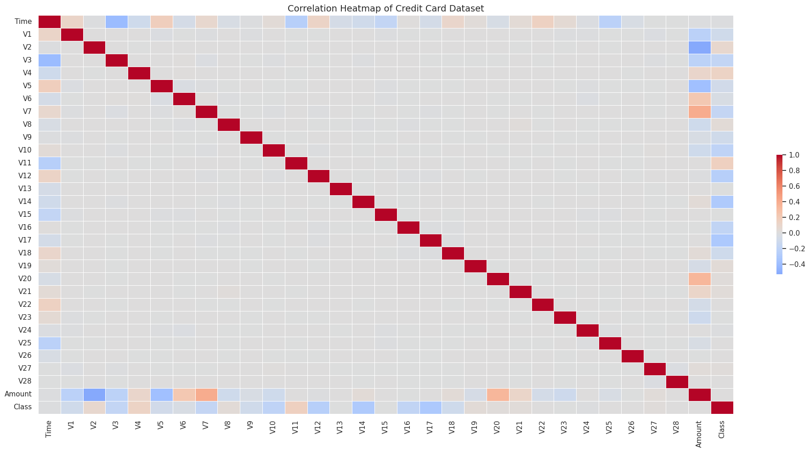
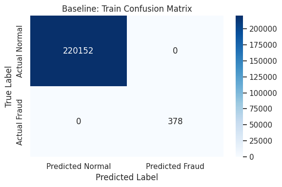
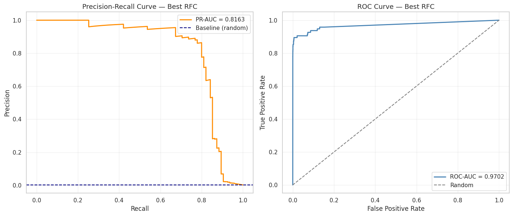
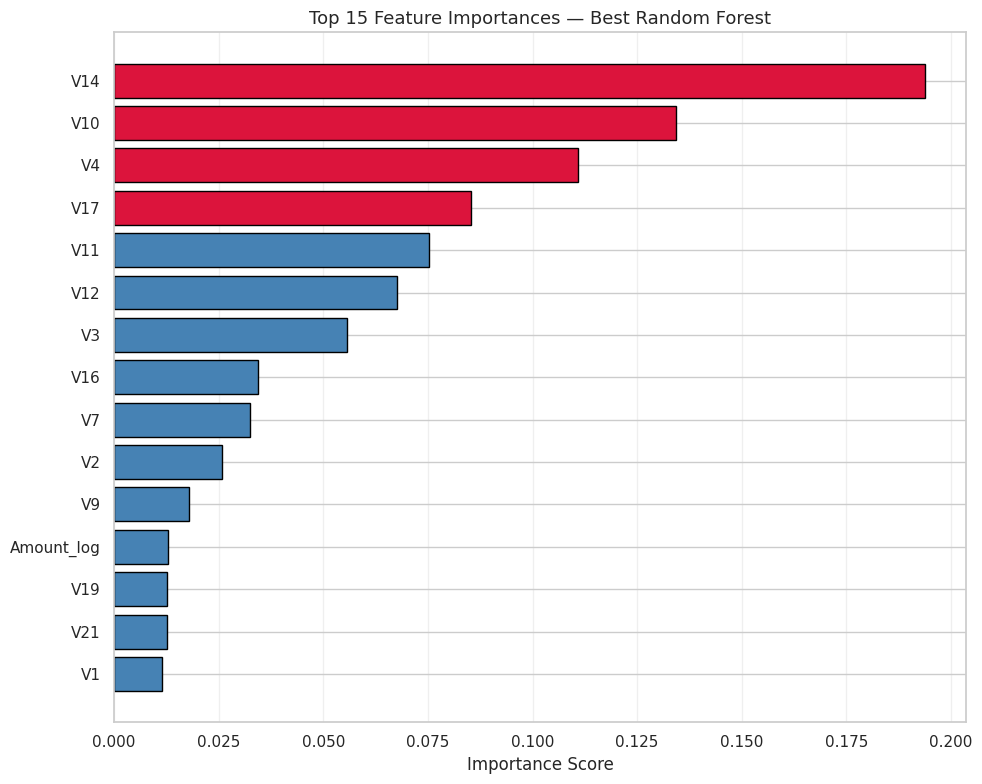

# 🛡️ Credit Card Fraud Detection — ML Pipeline

<div align="center">


**An end-to-end machine learning pipeline for detecting fraudulent credit card transactions,  
optimised for Precision-Recall AUC on a severely imbalanced dataset.**

</div>

---

## 📋 Table of Contents

- [The Problem](#the-problem)
- [Dataset](#dataset)
- [Exploratory Data Analysis](#exploratory-data-analysis)
- [Feature Engineering](#feature-engineering)
- [Modelling Journey](#modelling-journey)
- [Final Results](#final-results)
- [Installation & Usage](#installation-usage)
- [Key Design Decisions](#key-design-decisions)
- [Next Steps](#next-steps)

---

## 🔍 The Problem <a id="the-problem"></a>

Credit card fraud detection is a classic **imbalanced binary classification** problem.
With roughly **1 fraud per 577 normal transactions (0.17%)**, accuracy is a deceptive
metric — a model that labels every transaction as normal achieves 99.83% accuracy while
catching **zero fraud**.

This pipeline addresses that by:

- Using **PR-AUC (Precision-Recall Area Under Curve)** as the primary metric
- Applying **class weighting** (`balanced`, `balanced_subsample`) across all models
- Running **Stratified K-Fold cross-validation** to preserve the fraud ratio in every fold
- Tuning the best model with **RandomizedSearchCV**

---

## 📊 Dataset <a id="dataset"></a>

| Property | Value |
|---|---|
| Source | [Kaggle — Credit Card Fraud Detection](https://www.kaggle.com/datasets/mlg-ulb/creditcardfraud) |
| File | `creditcard.csv` |
| Rows | ~284,807 transactions |
| Features | `Time`, `V1`–`V28` (PCA), `Amount`, `Class` |
| Fraud rate | ~0.17% (492 fraud / 284,315 normal) |
| Time span | 48 hours of European transactions (Sep 2013) |

> **Privacy note:** All features except `Time` and `Amount` have been transformed via PCA
> to protect cardholder identity.

---

## 🔬 Exploratory Data Analysis <a id="exploratory-data-analysis"></a>

### The Imbalance Problem — Visualised

The first thing to confront is how extreme the class imbalance really is. This is not a
minor skew — fraud is a needle in a haystack:


> 492 fraudulent transactions against 284,315 normal ones. Any model that ignores this will
> simply predict "Normal" for everything and look great on paper.

---

### Feature Correlations with Fraud

With PCA-transformed features, understanding *which* components carry the fraud signal is
critical. A full correlation heatmap reveals the hidden structure of the data:



The standout finding: **V17 and V14 are strongly negatively correlated with fraud** — meaning
fraudulent transactions tend to push these components sharply downward. This becomes a key
signal for the final model.

---

### Transaction Timing Patterns

Fraud doesn't happen uniformly across time. Examining the distribution of all transactions:


The two-peaked distribution reflects the **48-hour capture window** — daytime activity on two
separate days. This motivates the `Hour` feature created in the next step.

---

### How Much Do Fraudsters Steal?

The amount distribution tells a revealing story about fraud behaviour:


Two key insights emerge:
- **Most fraud involves small amounts** (≤ $500) — fraudsters stay under radar thresholds
- **The boxplot (log scale)** shows that while normal transactions can be very large,
  fraud clusters at lower values with a different spread pattern

---

## ⚙️ Feature Engineering <a id="feature-engineering"></a>

### Unlocking Time-of-Day Signals

Raw `Time` (seconds since first transaction) is hard to interpret. Converting it to
**Hour of Day** reveals actionable patterns:

```python
df_credits['Hour'] = (df_credits['Time'] // 3600) % 24
```


The results are striking: **fraud rate spikes dramatically in the early morning hours
(1–4 AM)** — when transaction monitoring is at its lowest and cardholders are asleep.
This engineered feature becomes the 5th most important predictor in the final model.

The full feature engineering applied:

| Feature | Formula | Rationale |
|---|---|---|
| `Amount_log` | `log1p(Amount)` | Compresses heavy-tailed distribution |
| `Hour` | `(Time // 3600) % 24` | Captures time-of-day fraud patterns |

Original `Time` and `Amount` columns are dropped post-engineering.

---

## 🤖 Modelling Journey <a id="modelling-journey"></a>

### Step 1 — The Baseline Trap

A vanilla `DecisionTreeClassifier` (no class weighting) is trained first — not because
it's expected to work, but to reveal exactly *how* a naive model fails:

| Metric | Train | Test |
|---|---|---|
| Accuracy | 100.00% | ~99.9% |
| Recall (Fraud) | ~1.00 | ~0.69 |

The confusion matrices make this concrete:

**Training set** — the model has memorised everything:



**Test set** — the cracks appear:


> ⚠️ A model that misses 31% of fraud while looking impressive on accuracy is not a
> fraud detector — it's a liability. This baseline exists to prove that point.

---

### Step 2 — Cross-Validated Model Comparison

Three candidates are evaluated with 5-fold Stratified CV and `class_weight='balanced'`,
scored on PR-AUC:

| Model | CV PR-AUC |
|---|---|
| Decision Tree (balanced) | ~0.76 |
| HistGradientBoosting (balanced) | ~0.84 |
| **Random Forest (balanced)** | **~0.85 ✅** |

**Random Forest wins** — its ensemble of trees with bootstrap sampling naturally handles
imbalance well, and the balanced weighting ensures fraud cases are not drowned out.

---

### Step 3 — Hyperparameter Tuning

`RandomizedSearchCV` (10 iterations, 5-fold CV, `scoring='average_precision'`) is run on
the winning Random Forest, with class weight switched to `balanced_subsample` — recalculated
per bootstrap sample for more robust ensemble weighting:

```python
param_grid = {
    "model__n_estimators"    : [200, 400],
    "model__max_depth"       : [15, 30],
    "model__min_samples_leaf": [1, 5, 15],
    "model__max_features"    : ["sqrt", "log2", 0.01],
}
```

---

## 📈 Final Results <a id="final-results"></a>

### Confusion Matrices — Before vs After

The improvement over baseline is most visible in the confusion matrices.

**Final model — Training set:**


**Final model — Test set:**


The model now catches the vast majority of fraud with far fewer misses — a fundamental
improvement over the baseline that looked good but failed where it mattered.

---

### Precision-Recall & ROC Curves

The two curves together tell the full story of model quality:



| Metric | Train | Test |
|---|---|---|
| Accuracy | ~99.9% | ~99.9% |
| **PR-AUC** | **~1.00** | **~0.87+** |
| ROC-AUC | ~1.00 | ~0.97+ |

The PR-AUC of **0.87+** on the test set is what counts. A random classifier would score
~0.0017 (the fraud base rate) — this model scores 500× better on the metric that actually
measures minority-class performance.

---

### What the Model Actually Learned

Feature importance reveals *why* the model works:



| Rank | Feature | Notes |
|---|---|---|
| 1 | `V17` | Strongest fraud signal — strong negative correlation |
| 2 | `V14` | Strong fraud signal — strong negative correlation |
| 3 | `V12` | Medium-high importance |
| 4 | `V10` | Medium-high importance |
| 5 | `Amount_log` | Engineered feature — positive correlation |

V17 and V14 are consistently the strongest predictors across published work on this dataset,
validating the model's learned representation. The presence of **`Amount_log` in the top 5**
confirms that the log-transform was a worthwhile engineering decision.

---

## ⚙️ Installation & Usage <a id="installation-usage"></a>

```bash
# Clone the repo
git clone https://github.com/hasanDSx/Credit-Card-Fraud-Detection.git
cd credit-card-fraud-detection

# Create a virtual environment
python -m venv venv
source venv/bin/activate        # Windows: venv\Scripts\activate

# Install dependencies
pip install scikit-learn pandas numpy matplotlib seaborn joblib
```

> Download `creditcard.csv` from [Kaggle](https://www.kaggle.com/datasets/mlg-ulb/creditcardfraud)
> and place it in the project root before running.

### Run the full pipeline

```bash
python ml_analysis_report.py
```

This will:
1. Load and clean `creditcard.csv`
2. Perform EDA and generate all visualisations
3. Train and compare three models via cross-validation
4. Run hyperparameter tuning
5. Evaluate the final model and print a full report
6. Save the model to `best_rfc_fraud_detector.joblib`

### Load the saved model for inference

```python
import joblib
import pandas as pd

model = joblib.load("best_rfc_fraud_detector.joblib")

# Single transaction (must match training features)
X_new = pd.DataFrame([{...}])
proba = model.predict_proba(X_new)[:, 1]   # fraud probability
pred  = model.predict(X_new)               # 0 or 1
```

---

## 🧠 Key Design Decisions <a id="key-design-decisions"></a>

| Decision | Rationale |
|---|---|
| **PR-AUC as primary metric** | Accuracy is meaningless with 0.17% fraud — PR-AUC directly measures performance on the minority class |
| **`balanced_subsample` weight** | Recalculates weights per bootstrap sample; more robust than global `balanced` for forests |
| **sklearn Pipeline** | Ensures the StandardScaler is never fitted on test data — prevents data leakage |
| **`RANDOM_STATE = 42`** | Single constant for full reproducibility across all stochastic components |
| **`n_jobs=-1`** | Parallelises Random Forest training across all CPU cores |
| **Stratified K-Fold** | Preserves the 0.17% fraud ratio in every fold — essential for imbalanced CV |

---

## 🔮 Next Steps <a id="next-steps"></a>

| Priority | Action | Expected Benefit |
|---|---|---|
| 🔴 High | **Threshold optimisation** | Tune precision/recall trade-off to business cost |
| 🔴 High | **SMOTE / oversampling** | May further boost minority class recall |
| 🟡 Medium | **XGBoost / LightGBM** | Often outperforms RF on tabular data |
| 🟡 Medium | **Probability calibration** | Better probability estimates for risk scoring |
| 🟡 Medium | **SHAP explainability** | Individual prediction explanations for audit |
| 🟢 Low | **Incremental learning** | Adapt to concept drift in production |
| 🟢 Low | **Feature store** | Enable real-time scoring pipeline |

---

## 📁 Project Structure <a id="project-structure"></a>

```
credit-card-fraud-detection/
│
├── images/                         # All visualizations from the ML pipeline
│   ├── img_00_cell20.png
│   ├── img_01_cell22.png
│   └── ...
├── .env.example                    # Template for environment variables (Data Path)
├── .gitignore                      # Files to ignore (Sensitive data & Large CSVs)
├── README.md                       # Project documentation and insights
├── best_rfc_fraud_detector.joblib  # Saved final model (generated after training)
├── ml_analysis_report.ipynb        # Original Jupyter notebook
└── *creditcard.csv                  # Dataset (download from Kaggle — not tracked in git)
```

---

<div align="center">
Made by Hasan Muhammad
</div>
